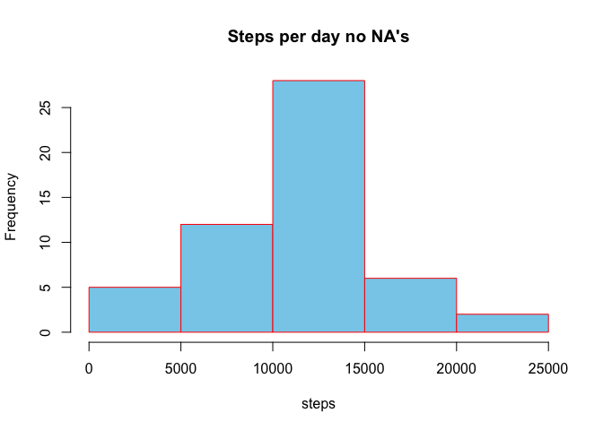

## Loading and preprocessing the data


```r
if(!file.exists('activity.csv')){
    unzip('activity.zip')
}
raw_data <- read.csv('activity.csv')
data = raw_data
```

```
## 
## Attaching package: 'dplyr'
```

```
## The following objects are masked from 'package:stats':
## 
##     filter, lag
```

```
## The following objects are masked from 'package:base':
## 
##     intersect, setdiff, setequal, union
```
Now we have the data in data variable.
Lets checkout the data a bit

```r
head(data, 3)
```

```
##   steps       date interval
## 1    NA 2012-10-01        0
## 2    NA 2012-10-01        5
## 3    NA 2012-10-01       10
```


\
\
## What is mean total number of steps taken per day?


```r
# add hour / min detail
# so at interval 2355 the time is 23:55 or 5 minuters to midnight.
data <- mutate(data, hour = interval %/% 100, minute = interval %% 100)
```
*For this part of the assignment, you can ignore the missing values in the dataset.*

```r
dataNoNa <- data[complete.cases(data), ]
```
*Calculate the total number of steps taken per day*


```r
totalSteps  <- aggregate(steps ~ date, dataNoNa, sum)
```
*If you do not understand the difference between a histogram and a barplot, research the difference between them. Make a histogram of the total number of steps taken each day.*

```r
hist(totalSteps$steps, xlab="steps",ylab="Frequency",col="skyblue",border="red",
     main="Histogram of the total number of steps taken each day")
```

<!-- -->

*Calculate and report the mean and median of the total number of steps taken per day*


```r
mean(totalSteps$steps) ## get the mean
```

```
## [1] 10766.19
```


```r
median(totalSteps$steps) ## get the median
```

```
## [1] 10765
```


## What is the average daily activity pattern?

*Make a time series plot (i.e. 𝚝𝚢𝚙𝚎 = "𝚕") of the 5-minute interval (x-axis) and the average number of steps taken, averaged across all days (y-axis)*


```r
stepsInterval  <- aggregate(steps ~ interval, dataNoNa, mean)
```

We have the average value for each interval.  so for all values of interval 1000 we have the mean for all dates.
Now lets make a plot of this.

```r
plot(stepsInterval$interval, stepsInterval$steps, type="l", col=3, main="Steps by Time of Day", 
     xlab="Time of Day (interval)", ylab="Average Number of Steps", xlim=c(0,2355))
axis(side=1, at=seq(0, 2400, by=500))
```

<!-- -->

?*Which 5-minute interval, on average across all the days in the dataset, contains the maximum number of steps?*

Max steps taken at interval

```r
int = which.max(stepsInterval$steps)
```
Value at this interval

```r
colMax <- max(stepsInterval$steps)
```
Max steps taken at interval `int` with `colMax` average steps taken. apparently this person does 
a lot of walking around `data[104,]$interval` AM.


## Imputing missing values

*Note that there are a number of days/intervals where there are missing values (coded as 𝙽𝙰). The presence of missing days may introduce bias into some calculations or summaries of the data.*

*Calculate and report the total number of missing values in the dataset (i.e. the total number of rows with NA's*

```r
sum(is.na(data[,1]))
```

```
## [1] 2304
```

```r
nrow(data[!complete.cases(data), ])
```

```
## [1] 2304
```
*Devise a strategy for filling in all of the missing values in the dataset. The strategy does not need to be sophisticated. For example, you could use the mean/median for that day, or the mean for that 5-minute interval, etc.*

```r
imp_data = raw_data
```
**Let's fill in the NA with the aveage**

*Create a new dataset that is equal to the original dataset but with the missing data filled in.*

```r
for (i in 1:nrow(imp_data)) {
  if (is.na(imp_data$steps[i])) {
    interval_value <- imp_data$interval[i]
    steps_value <- stepsInterval[
      stepsInterval$interval == interval_value,]
    imp_data$steps[i] <- steps_value$steps
  }
}
```
*Make a histogram of the total number of steps taken each day and Calculate and report the mean and median total number of steps taken per day. Do these values differ from the estimates from the first part of the assignment?*


```r
imp_steps  <- aggregate(steps ~ date, imp_data, sum)
```
*If you do not understand the difference between a histogram and a barplot, research the difference between them. Make a histogram of the total number of steps taken each day.*

```r
hist(totalSteps$steps, xlab="steps",ylab="Frequency",col="skyblue",border="red",
     main="Steps per day no NA's")
```

<!-- -->

*What is the impact of imputing missing data on the estimates of the total daily number of steps?*

```r
par(mfrow = c(1, 2), mar = c(4, 4, 2, 1))
hist(totalSteps$steps, xlab="steps",ylab="Frequency",col="skyblue",border="red",
     main="Steps per day no NA's")
hist(imp_steps$steps, xlab="steps",ylab="Frequency",col="skyblue",border="red",
     main="Steps per day (Imputed)")
```

<!-- -->

**Higher frequency for steps during the day time**


## Are there differences in activity patterns between weekdays and weekends?

*For this part the 𝚠𝚎𝚎𝚔𝚍𝚊𝚢𝚜() function may be of some help here. Use the dataset with the filled-in missing values for this part.*

*Create a new factor variable in the dataset with two levels – “weekday” and “weekend” indicating whether a given date is a weekday or weekend day.*


```r
week_day <- function(date_val) { ##week day function for apply
    wd <- weekdays(as.Date(date_val, '%Y-%m-%d'))
    if  (!(wd == 'Saturday' || wd == 'Sunday')) {
        x <- 'Weekday'
    } else {
        x <- 'Weekend'
    }
    x
}
data$day_type <- as.factor(sapply(data$date, week_day))
```

make two sets of data, one for weekends and one for work week.


```r
dataNoNa <- data[complete.cases(data), ]

workWeek <- subset(dataNoNa, day_type == "Weekday")
weekEnd <- subset(dataNoNa, day_type == "Weekend")

str(workWeek)
```

```
## 'data.frame':	11232 obs. of  6 variables:
##  $ steps   : int  0 0 0 0 0 0 0 0 0 0 ...
##  $ date    : Factor w/ 61 levels "2012-10-01","2012-10-02",..: 2 2 2 2 2 2 2 2 2 2 ...
##  $ interval: int  0 5 10 15 20 25 30 35 40 45 ...
##  $ hour    : num  0 0 0 0 0 0 0 0 0 0 ...
##  $ minute  : num  0 5 10 15 20 25 30 35 40 45 ...
##  $ day_type: Factor w/ 2 levels "Weekday","Weekend": 1 1 1 1 1 1 1 1 1 1 ...
```

```r
str(weekEnd)
```

```
## 'data.frame':	4032 obs. of  6 variables:
##  $ steps   : int  0 0 0 0 0 0 0 0 0 0 ...
##  $ date    : Factor w/ 61 levels "2012-10-01","2012-10-02",..: 6 6 6 6 6 6 6 6 6 6 ...
##  $ interval: int  0 5 10 15 20 25 30 35 40 45 ...
##  $ hour    : num  0 0 0 0 0 0 0 0 0 0 ...
##  $ minute  : num  0 5 10 15 20 25 30 35 40 45 ...
##  $ day_type: Factor w/ 2 levels "Weekday","Weekend": 2 2 2 2 2 2 2 2 2 2 ...
```

*Make a panel plot containing a time series plot (i.e. 𝚝𝚢𝚙𝚎 = "𝚕") of the 5-minute interval (x-axis) and the average number of steps taken, averaged across all weekday days or weekend days (y-axis). See the README file in the GitHub repository to see an example of what this plot should look like using simulated data.*


```r
wrkWSteps  <- aggregate(steps ~ interval, workWeek, mean)
wkendSteps <- aggregate(steps ~ interval, weekEnd, mean)
```
Draw the plot

```r
par(mfrow = c(1, 2), mar = c(4, 4, 2, 1))
plot(wrkWSteps$interval, wrkWSteps$steps, type="l", col=4, main="WeekDay Steps", 
     xlab="Time of Day (interval)", ylab="Average Number of Steps")
plot(wkendSteps$interval, wkendSteps$steps, type="l", col=4, main="WeekEnd Steps", 
     xlab="Time of Day (interval)", ylab="Average Number of Steps")
```

<!-- -->


**We notice that this person walks more often throughout the weekend.  Perhaps they exercise in the morning and sit at a desk during the day?**
